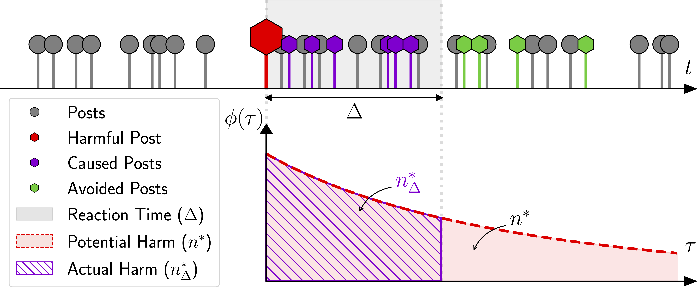
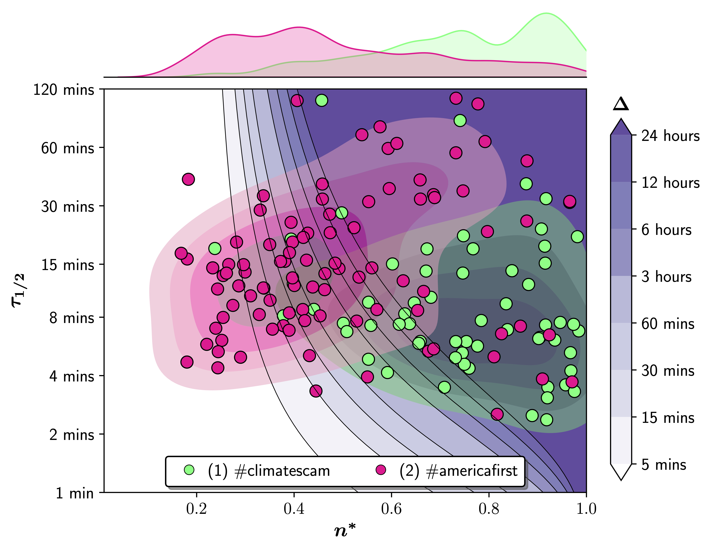
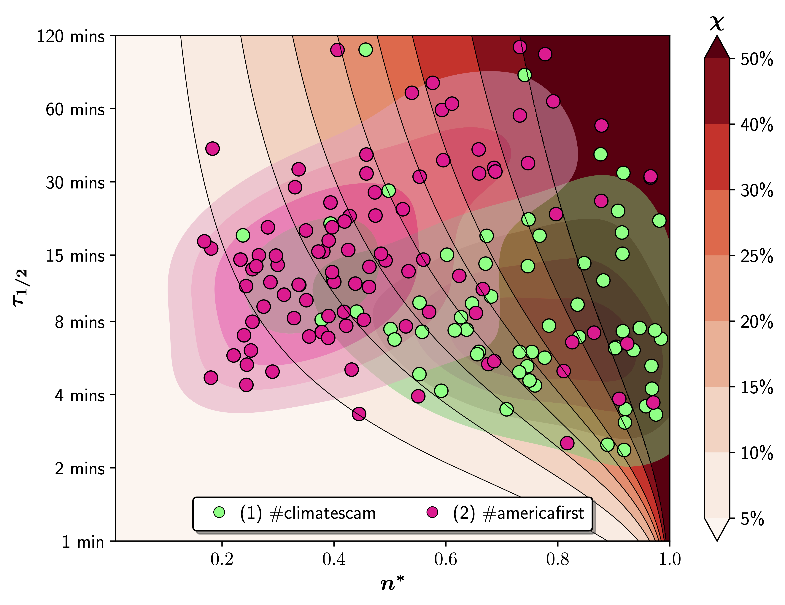

# dsa-content-moderation

This repository contains code and data accompanying the publication "Digital Services Act: Estimate the Effectiveness of Moderating Harmful Online Content"

## Reference:
* TBD

## Repository Content:
This repository contains the following code scripts:
* `scripts/twitter-data-extraction.ipynb`: A notebook used to extract data via the Twitter API. For information on accessing Twitter API for academic research, please refer to the official Twitter documentation on [academic research access](https://developer.twitter.com/en/products/twitter-api/academic-research).
* `scripts/run_hawkes_pwl.py`: A script that fits the data starting from `data/twitter-<topic>-hashtag.csv`. For further information on fitting Hawkes processes, refer to [evently](https://github.com/behavioral-ds/evently), [tick](https://github.com/X-DataInitiative/tick), [hawkesbook](https://github.com/Pat-Laub/hawkesbook) or other packages. 
* `scripts/plot-contours.ipynb`: A notebook that postprocesses the fits, constructs contour plots, and illustrates the fitted data.
* `scripts/plot-social-media-dynamics-deletion.ipynb`: A notebook used to plot Fig. 1.
* `scripts/dsa_functions.py`: Additional functions for reading and analyzing data.

The following data and plots are also available:
* `data/twitter-climatescam-hashtag.csv` – Contains tweet IDs from Twitter associated with the hashtag #climatescam.
* `data/twitter-americafirst-hashtag.csv` – Contains tweet IDs from Twitter associated with the hashtag #americafirst or #americansfirst. 
Note: These are dehydrated datasets compiled in compliance with the Twitter Terms of Service. Please refer to further documentation on hydration to obtain the underlying data.
* `plots/delete-plot.pdf` - Fig. 1 - Social Media Dynamics as Self-Exciting Point Process.
* `plots/delta-chi20p-deletion.pdf` - Fig. 2 (a) - Reaction time $\Delta$ to achieve harm reduction of $\chi=20$\%.
* `plots/chi-delta24hour-deletion` - Fig. 2 (b) - Harm reduction $\chi$ when content is removed within $\Delta=24$ hours.

Fig. 1 - Social Media Dynamics as Self-Exciting Point Process.

Fig. 2 (a) - Reaction time $\Delta$ to achieve harm reduction of $\chi=20$\%.

Fig. 2 (b) - Harm reduction $\chi$ when content is removed within $\Delta=24$ hours.

## License:
Both the dataset and the code in this repository are distributed under the General Public License v3 (GPLv3) license. You can find a copy of the license in the LICENSE file included in this repository. If you have any inquiries regarding licensing or any other questions, please feel free to reach out to us at Marian-Andrei@rizoiu.eu.
